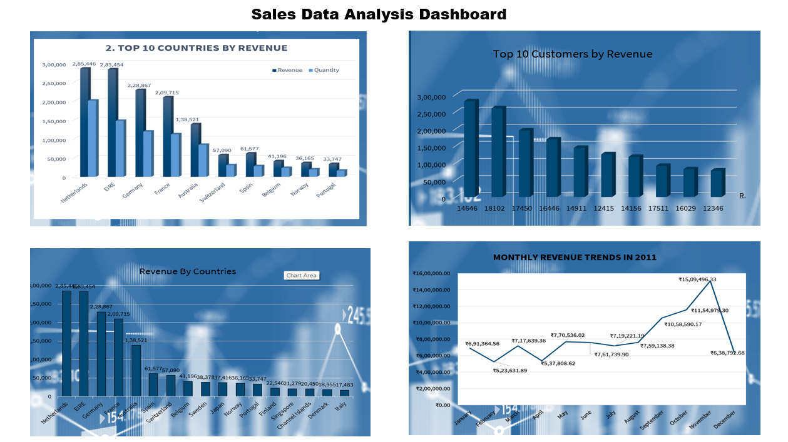
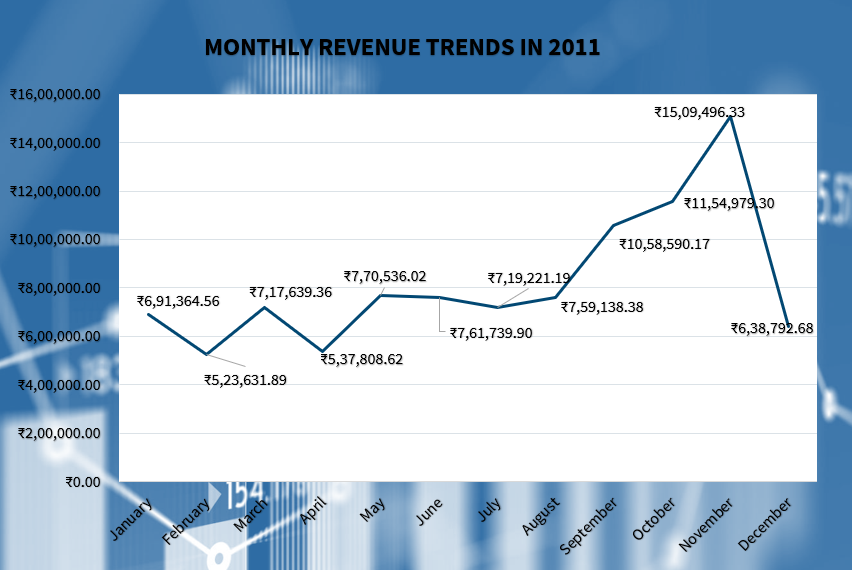
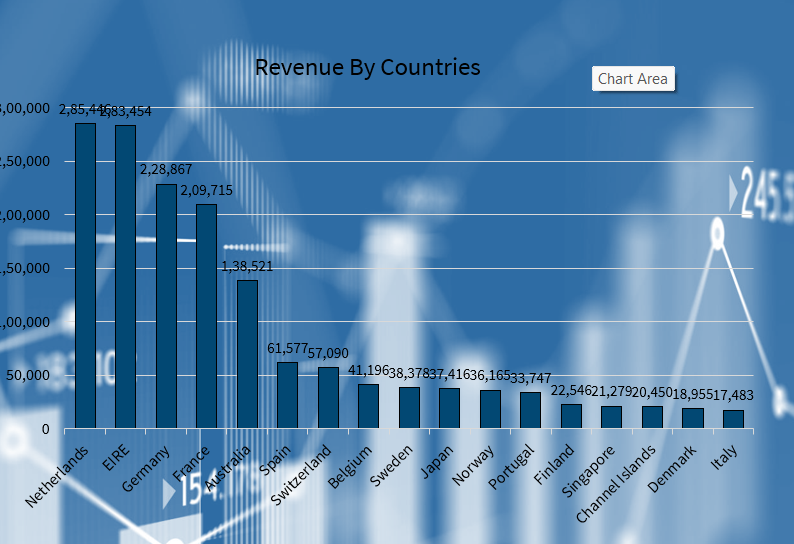
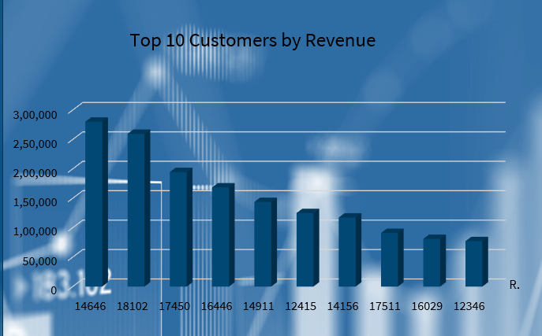
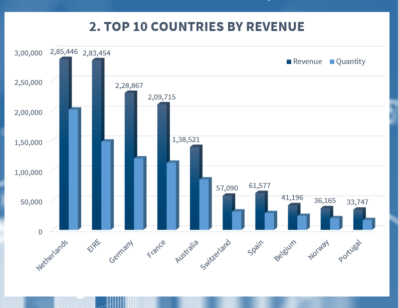

# Sales Data Analysis Project 

      
           fig.Dashboard 

This repository contains a Tableau-based sales data analysis project completed  as part of a virtual  internship. The project includes detailed analysis , visualizations, a presentation, and supporting materials.

## Objectives 

To analyze international sales data, 
1)Identify Revenue Trends
   - Analyze monthly sales patterns to highlight seasonal trends and peaks.
2)Focus on High-Performing Markets
   - Determine the top revenue-generating countries (excluding the UK) and assess their potential for further investment.
3)Explore Expansion Opportunities
  - Identify regions with strong product demand, excluding the UK, to guide market expansion plans.
4)Retain Key Customers
  - Pinpoint high-value customers to develop strategies that ensure loyalty and sustained revenue.
and provide actionable business insights for improving performance and targeting growth opportunities.

## Data Preparation

1)Data Cleaning 
  - Remove incorrect records (negative quantities and unit prices below $0).

2)Calculate Revenue
  - Quantity × Unit Price.

3)Data Validation
  - Verified data for accuracy before analysis.
 
4)Data Visualization
  - Tool: Tableau for visualization and insights generation.

## Key Areas of Analysis

1. Monthly Revenue Trends
  - Seasonal patterns indicate peak months . 
  - Focus on promotions and inventory during these periods.

    

2. Top Revenue-Generating Countries
   - Excluding UK, Germany and France are key markets.
   - Targeted marketing campaigns recommended.

     
     

3. Top Customers by Revenue
   - Focus on retaining high-value customers with loyalty programs.

       

4. Product Demand by Country
   - High demand in regions like Australia and the Netherlands.
   - Expansion opportunities identified.

     

   
     

